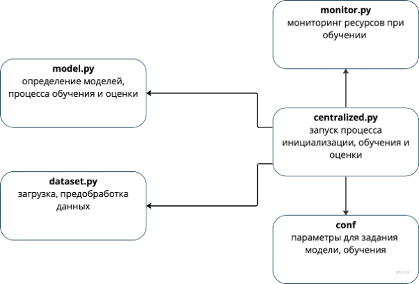

# research
# Обнаружение вторжений в децентрализованных информационных системах на основе методов федеративного машинного обучения

## ЦЕЛЬ:
Разработка прототипа системы обрнаружения вторжений для децентрализованных информационных систем на примере интернета вещей (IoT).
Сравнение федеративного подхода с централизованным.

## Исследуемый набор данных:
[CiCIoT2023](https://www.unb.ca/cic/datasets/iotdataset-2023.html)

## Используемый framework федеративного обучения:
[flower.dev](https://flower.dev)

## data_exploratin – исследование данных
- `EDA_feature_importance.ipynb`

## xgboost – исследование модели xgboost
- `centralized.py` - архитектура централизованного обучения
- `federated.py` - архитектура федеративного обучения
- `dataset.py` - предобработка данных
- `client.py` - клиент федеративного обучения
- `server.py` - сервер федеративного обучения
- `utils.py` - вспомогательные функции
- `monitor.py` - функции отслеживания задействования вычислительных ресурсов
- `conf`: - задание конфигурации моделеи и процесса обучения
  - `strategy`:
    - `fedxgbbagging.yaml`   
  - `base_centralized.yaml`
  - `base_federated.yaml` 
  

## neural_networks – исследование нейронных моделей
- `centralized.py` - архитектура централизованного обучения
- `federated.py` - архитектура федеративного обучения
- `dataset.py` - предобработка данных
- `client.py` - клиент федеративного обучения
- `server.py` - сервер федеративного обучения
- `monitor.py` - функции отслеживания задействования вычислительных ресурсов
- `conf`: - задание конфигурации моделеи и процесса обучения
  - `model`:
    - `bilstm.yaml`
    - `cnn.yaml`
    - `gru.yaml`
    - `lstm.yaml`
    - `mlp.yaml`
  - `strategy`:
    - `fedavg.yaml`
    - `fedadam.yaml`
    - `fedprox.yaml`
  - `base_centralized.yaml`
  - `base_federated.yaml`

## Архитектура ПО для проведения исследований

